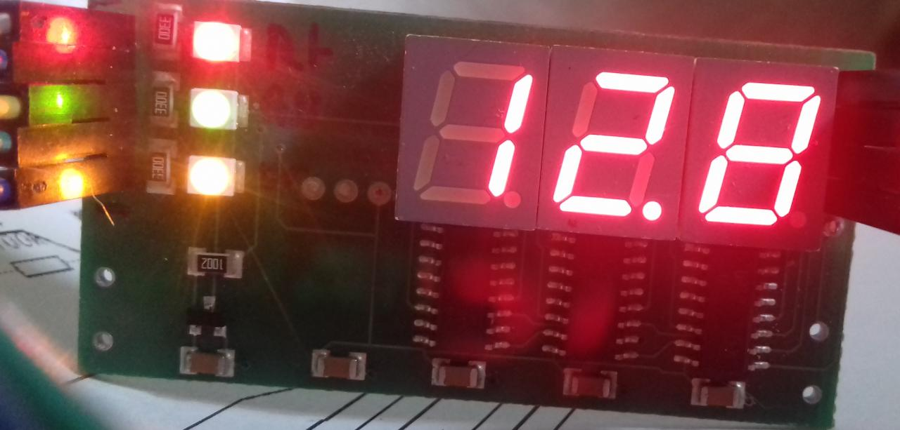

# Recycled 7Segment Display with HCF4094.

This piece comes from a dishwasher. The LEDs have their individual pins.
The shift registers are daisy chained and STROBEs are connected to OEs.
Code is very simple. See `src/main.c`.




## Requirements
You will need a suitable arm-gcc for building and texane's st-link utility for flashing.  
If you're using ARM's official gcc distribution everything will be fine.
  
libopencm3 is included in this archive.  

## Compiling
```
$ make
```
This will build libopencm3 and the PWM-code. It will generate an ELF, a BIN and a HEX binary.

## libopencm3
There is a "static" copy of libopencm3 in `src/` unlike other examples and tutorials on the internet,
which use a git submodule to allow automatic updating of libopencm3.  
I prefer *not* to update a project's library once it is working, as it could break things.  
Once you're done and your device is running the working firmware you really should keep a exact copy
of your sourcecode.  
Updating is a good thing, but only if you know what you're doing and in this case, only if needed.  
  
I have removed a lot of stuff from libopencm3's source directory which targets other MCUs.

## Licensing
libopencm3 is GNU LGPL v3.  
Makefile and demo-code written by me is 'public domain'.  

